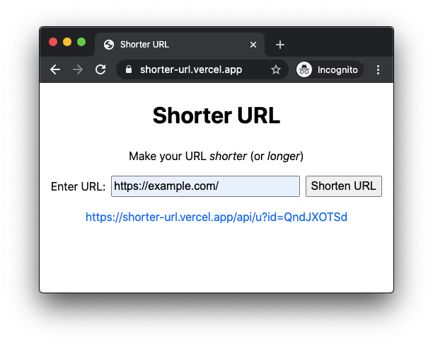

# Shorter URL

Make your URL *shorter* (or *longer*).

https://shorter-url.vercel.app/



## API

The API endpoint is `https://shorter-url.vercel.app/api/short`. Use the `url`
query parameter to shorten the URL, e.g.,
https://shorter-url.vercel.app/api/short?url=https://example.com

```
$ curl -i 'https://shorter-url.vercel.app/api/short?url=https://example.com'
HTTP/2 200
content-type: application/json
cache-control: max-age=0
date: Thu, 13 Aug 2020 12:30:49 GMT
access-control-allow-origin: *
content-length: 125
x-vercel-cache: MISS
age: 0
server: Vercel
x-vercel-id: hkg1::sfo1::b2dbn-1597321847484-3e8254ee7e87
strict-transport-security: max-age=63072000; includeSubDomains; preload

{
  "ok": true,
  "original_url": "https://example.com",
  "short_url": "https://shorter-url.vercel.app/api/u?id=CvYbGfKVd"
}
```

## Service providers

The website is hosted on [Vercel](https://vercel.com/). The database service is
provided by MongoDB Atlas.
